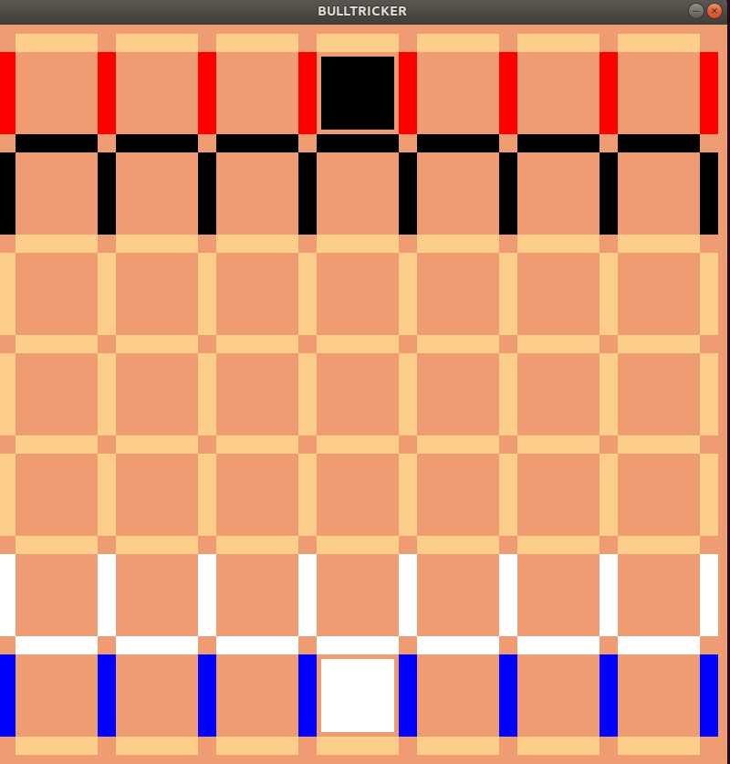
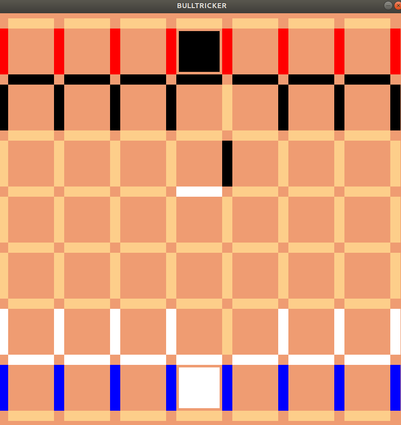

# BullTricker


<p align="center" width="100%">
     
</p>


<p align="center" width="100%">
     
</p>


<p align="center" width="100%">
     
</p>

<p align="center" width="100%">
     
</p>


# Requirements

- C compiler (gcc).
- GNU/Linux.
- SDL2 library.

# Running

To check that SDL2 is working tape the comand 
```
  $ make check
```

compile with 'make'
```
  $ make
```
run with 'make run'

```
  $ make run
```

clean with 'make clean'
```
  $ make clean
```


# Bulltricker
